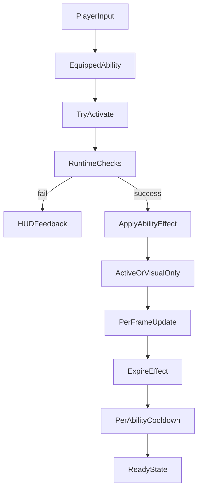

# Ability Framework

## Purpose

This document defines the gameplay, runtime, and data contract for the Megaman X-style ability system described in `design/master-plan.md`.

It exists to answer four questions before implementation:

- What the player can unlock, equip, activate, and cool down
- How ability state is represented during gameplay
- How ability visuals layer onto the existing snake/skin pipeline
- What minimum persistent and per-level data Phase 1 needs

## Canonical Source Of Truth

The master ability table and counter web in `design/master-plan.md` remain canonical for:

- ability names
- unlock source levels
- cooldowns
- durations
- primary effects
- strong-counter targets

This document defines how those values are expressed in code and moment-to-moment play.

## Design Decisions

- The player permanently unlocks abilities by defeating the corresponding boss.
- The player has exactly one equipped ability at a time during gameplay.
- The player may cycle among unlocked abilities during a run.
- Cooldowns are tracked per ability, not globally.
- Only one ability may be active at a time.
- Instant abilities still get a short visual window so activation feels readable.
- Ability visuals temporarily override level colors and cosmetic skin colors, then cleanly restore the prior appearance when the effect ends.
- The implementation should extend the existing `Ability.h/.cpp` scaffolding instead of replacing it outright.

## Player-Facing Model

### Unlocks

- `L2` through `L9` each unlock one permanent ability.
- Unlocking is campaign-persistent.
- An unlocked ability becomes available in all future stage replays and in Level 10.

### Equip And Switch

- The player equips one active selection at a time.
- Cycling should move through unlocked abilities only.
- Cycling should be available during gameplay, but not while the snake is dead, during cutscenes, or during transition locks.
- The currently equipped ability is a selection state only. Equipping does not start cooldowns or effects.

### Activation

- Activation attempts the currently equipped ability.
- If activation succeeds, the ability enters either `Active` or `VisualOnly` state depending on whether it has gameplay duration.
- If activation fails, nothing is consumed and no cooldown starts.

### Failure Rules

Activation fails when any of the following are true:

- the ability is not unlocked
- that ability is on cooldown
- another ability is already active
- the current context disallows use
- the ability-specific preconditions are not met

Examples of context/precondition failure:

- `Hunter's Dash` would collide with an unskippable blocker or leave the arena
- `Shed Skin` cannot drop the required number of segments
- `Shadow Decoy` is blocked by a boss arena rule that temporarily disables summons

## Runtime State Model

## State Vocabulary

- `Locked`: not yet earned in persistent progression
- `Ready`: unlocked and not cooling down
- `Active`: gameplay effect currently running
- `VisualOnly`: instant gameplay effect has resolved, but transform feedback is still visible
- `Cooldown`: effect has ended and the ability is recharging
- `Equipped`: selection marker applied on top of one of the above states

## Runtime Rules

- Each unlocked ability owns its own cooldown timer.
- Exactly one ability may occupy `Active` or `VisualOnly` at a time.
- Cooldown starts immediately on successful activation.
- `durationSec` controls the gameplay-active window.
- `instantVisualSec` controls instant-ability presentation only and does not imply repeated gameplay ticks.
- When `Active` or `VisualOnly` expires, the snake reverts to the normal render stack and the ability remains cooling down until its timer reaches zero.

## Recommended Runtime Shape

Use a hybrid model:

- Static, canonical data lives in ability definitions.
- Shared timing and equip/cooldown logic lives in one runtime controller.
- Ability-specific gameplay effects are dispatched through targeted handlers in `PlayState` and existing hazard systems.

This keeps `Ability.h/.cpp` as the common source for ids, cooldown data, visual specs, and runtime timing while avoiding eight deeply stateful subclasses on day one.

## Suggested Code Responsibilities

- `Ability.h/.cpp`
- Own `AbilityId`, canonical ability definitions, visual specs, and helper lookups.

- `AbilityRuntime` or `AbilityController`
- Own unlocked flags, equipped ability, active ability, active timer, and per-ability cooldown timers.

- `PlayState`
- Own input routing, activation requests, effect execution, and per-frame propagation into world hazards.

- `Snake`
- Accept transient visual override state from abilities.

- `AbilityHUD`
- Show equipped ability, ready/cooldown/active status, and cycling prompt.

## Runtime Flow



## Ability Timing Rules

- `Ink Flare`: active for `3s`, cooldown `10s`
- `Shed Skin`: instant effect, visual window `0.35s`, cooldown `12s`
- `Shadow Decoy`: active for `4s`, cooldown `12s`
- `Time Freeze`: active for `4s`, cooldown `15s`
- `Venom Trail`: active for `3s`, cooldown `10s`
- `Ink Anchor`: active for `5s`, cooldown `12s`
- `Hunter's Dash`: instant effect, visual window `0.25s`, cooldown `8s`
- `Ink Memory`: active for `6s`, cooldown `10s`

The current values in `src/Ability.cpp` already mostly match this model and should be treated as provisional implementation seeds, not a competing design source.

## Ability Effect Contract

Every ability should define four things:

- `ActivationCheck`: can this activate right now
- `Apply`: what happens immediately on success
- `UpdateWhileActive`: optional per-frame or per-tick behavior
- `Expire`: what cleanup is required when the effect ends

Recommended effect ownership:

- `Ink Flare`
- Applied by `PlayState`, consumed by blackout, mirror, apple-spawn preview, and boss-reveal systems

- `Shed Skin`
- Applied by `PlayState` with snake body data; spawns temporary world blockers or decoy segments

- `Shadow Decoy`
- Applied by `PlayState`; exposes a decoy target for enemy and boss targeting systems

- `Time Freeze`
- Applied centrally by `PlayState`; hazard systems read a shared time-freeze flag or timescale override

- `Venom Trail`
- Applied by `PlayState` and `Snake`; emits hazard trail data that enemies can query

- `Ink Anchor`
- Applied by `PlayState`; world and terrain systems query a movement-stability flag

- `Hunter's Dash`
- Applied immediately by `PlayState` with snake/world collision checks and apple sweep collection

- `Ink Memory`
- Applied by `PlayState`; control-shuffle and poison systems query a purification/stability flag

## Hidden Interactions

Hidden interactions should not be hard-coded as ad hoc pair checks inside `PlayState`.

Represent them as a lightweight interaction registry keyed by:

- `AbilityId`
- target level or mechanic tag
- effect modifier type

Recommended query shape:

- `GetAbilityInteraction(AbilityId ability, MechanicTag tag)`

Example mechanic tags:

- `Blackout`
- `Quicksand`
- `MirrorGhost`
- `TimedApples`
- `Poison`
- `Earthquake`
- `Predator`
- `ControlShuffle`

Example modifiers:

- reveal hidden info
- freeze timers
- ignore terrain slowdown
- generate bait target
- purify poison
- add stun on contact
- override remapped controls

This lets a level mechanic ask what the active ability changes without encoding campaign-wide design knowledge in the main game loop.

## Visual Layering

## Render Stack

Visual ownership should layer in this order:

1. level base colors and ink settings
2. selected cosmetic skin
3. active ability transform
4. one-off effect particles and post-processing

### Rules

- Ability transforms override skin colors while active.
- Cosmetic skins still matter when no ability is active.
- Ability transforms may add temporary render flags, but should not permanently mutate the equipped skin.
- On expiration, the snake returns to the prior cosmetic appearance without needing to reconstruct the entire level state.

## Visual Requirements Per Ability

- `Ink Flare`: glow/lantern effect and local illumination pulse
- `Shed Skin`: pale translucent flash with dropped-segment splatter
- `Shadow Decoy`: darkened body plus ghostly decoy render
- `Time Freeze`: crystalline blue transform and scene desaturation
- `Venom Trail`: toxic green transform plus trail particles
- `Ink Anchor`: rigid rust-red form with stable body silhouette
- `Hunter's Dash`: cyan streak with motion blur and path emphasis
- `Ink Memory`: violet clean-line form with corruption wobble suppressed

`Snake` should not own all of these behaviors directly. It should own only the transient render override data it needs to draw itself, while particles, screen effects, and special helper visuals remain in their dedicated systems.

## HUD Contract

The ability HUD should show:

- equipped ability name
- locked vs ready vs active vs cooldown state
- remaining active time when applicable
- remaining cooldown time when applicable
- cycling and activation prompts

The existing `src/AbilityHUD.h/.cpp` is a useful starting point, but it should be extended for per-ability cooldowns and clearer locked/ready feedback once more than one ability can be unlocked at a time.

## Persistence Model

The following state belongs in `StateManager` and save data:

- unlocked ability bitset or fixed-size array
- equipped ability selection
- optional last-used ability for menu defaults

The following state does not need to persist across sessions:

- active ability
- active timer
- cooldown timers

Rationale:

- unlocks are progression
- equip choice is player preference
- active/cooldown state is run-local combat state

## Minimum Phase 1 Data Changes

### `StateManager`

Add:

- unlocked ability collection for the 8 abilities
- equipped ability id

Keep `currentLevel`, score, and other run-local values separate from ability progression.

### `SaveManager`

Add:

- save version bump
- serialized unlocked-ability data
- serialized equipped-ability selection

### `LevelConfig`

Add only the minimum metadata required for Phase 1:

- `abilityReward`

Do not move the whole game to a fully data-driven ability schema yet. Current hazard booleans can stay in place while the ability framework is introduced.

This document claims only the Phase 1 `LevelConfig` change. Later phases may add Stage Select presentation metadata and `bossConfig`, but those should layer on top of `abilityReward` rather than replacing or duplicating it.

## Recommended Interfaces

The final implementation does not need to match these names exactly, but it should provide equivalent contracts:

```cpp
struct AbilityState {
    bool unlocked = false;
    float cooldownRemaining = 0.0f;
};

class AbilityController {
public:
    void Update(float dt);
    bool TryActivateEquipped(const AbilityContext& ctx);
    void CycleEquipped(int direction);

    AbilityId GetEquipped() const;
    AbilityId GetActive() const;
    float GetActiveRemaining() const;
    float GetCooldownRemaining(AbilityId id) const;
    bool IsUnlocked(AbilityId id) const;
};
```

## Phase 1 Scope Boundary

This document intentionally does not define:

- boss framework details
- stage select progression logic
- post-boss cutscene routing
- Level 10 sequencing

It only defines the ability framework needed to begin the Phase 1 implementation from the master plan.

## Implementation Notes Against Current Code

- `src/Ability.h/.cpp` already provides `AbilityId`, base definitions, visual specs, and a simple `AbilityRuntime`.
- That runtime currently supports only one shared cooldown lane; the final system should expand to per-ability cooldown tracking.
- `src/AbilityHUD.h/.cpp` already assumes an equipped ability plus activation/cycle prompts, which aligns with the one-equipped-at-a-time decision in this document.
- `src/Snake.h` and `src/SnakeSkin.h` already separate base colors from cosmetic skins, which makes temporary ability overlays practical without rewriting the whole renderer.
- `src/PlayState.h` already centralizes hazard systems, so Phase 1 should route most ability effects through `PlayState` rather than distributing orchestration across unrelated classes.

## Exit Criteria

The ability framework is fully designed when implementation can proceed without open questions about:

- how abilities unlock
- how the player equips and activates them
- how cooldowns and durations behave
- how abilities expose effects to hazards and bosses
- how visuals and HUD state are derived
- what progression data must be saved
