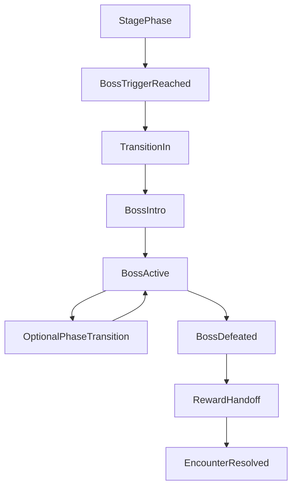

# Boss Framework

## Purpose

This document defines the shared runtime and design contract for bosses in the Megaman X-style redesign described in `design/master-plan.md`.

It exists to answer five questions before implementation:

- what the normal `stage -> boss -> reward` loop looks like
- what a shared boss base class owns versus what remains in `PlayState` and `World`
- how boss progress, phases, and defeat conditions are represented
- how abilities interact with bosses under the rules already defined in `design/master-plan.md` and `design/systems/ability-framework.md`
- what minimum engine-facing data is needed before the boss system is implemented

## Canonical Sources Of Truth

The following design sources remain canonical:

- `design/master-plan.md` for the campaign boss loop, default `3 hit points unless noted`, and the global rule that a strong counter deals `2 damage per hit` where HP is used
- `design/levels/level-02-blackout.md` through `design/levels/level-09-amnesia.md` for per-boss phase tuning, hit rules, transition flavor, and reward flow
- `design/levels/level-10-eraser.md` for the final boss exception model
- `design/systems/ability-framework.md` for activation, one-active-at-a-time ability runtime, and ability-to-mechanic integration rules

This document defines how those rules should be expressed in code and runtime ownership.

## Design Decisions

- Bosses use a shared base class plus per-boss subclasses.
- The base framework models progress as a generalized meter, not HP only.
- HP remains the default player-facing interpretation of progress for most bosses.
- Counter-abilities are handled through shared hooks plus per-boss overrides.
- `PlayState` remains the top-level encounter orchestrator.
- `World` remains the owner of arena bounds, shrink behavior, and spawn surface rules.
- Bosses may request arena behavior and hazard intensity changes, but should not take over the entire world simulation.
- Level 10 is a deliberate outlier and should not define the default base-class shape.

## Shared Boss Loop

The normal boss loop for `L2` through `L9` is:

1. Stage phase runs using the level's normal hazard rules.
2. A level-specific trigger starts the boss transition.
3. The arena enters boss mode.
4. The boss spawns and begins active combat.
5. The player advances the boss's progress meter through the level's hit condition.
6. On defeat, gameplay hands off to reward flow: page heal, ability earned, and cutscene routing.

The boss framework stops at the handoff boundary. It defines the event that defeat occurred, not the full cutscene script.

## Boss Lifecycle

## State Vocabulary

- `Dormant`: boss not present during stage phase
- `TransitionIn`: stage has ended and the encounter is entering boss mode
- `Intro`: boss is spawned, presentation lock is active, combat has not started
- `Active`: boss combat is live
- `PhaseTransition`: boss is alive but temporarily in a scripted transition between phases
- `Defeated`: combat is over, defeat presentation is playing
- `Resolved`: reward handoff is complete and `PlayState` can leave encounter control

## Lifecycle Rules

- Only one boss encounter may be active at a time.
- Entering `TransitionIn` freezes or reshapes stage flow into boss flow.
- `Intro` may lock controls briefly for presentation, but should remain short.
- `Active` is the only state where the boss may accept damage or progress advancement.
- `PhaseTransition` is optional and boss-specific.
- `Defeated` should disable further damage intake and further player death caused by the boss unless a level explicitly wants a lingering hazard during defeat presentation.
- `Resolved` is not a long-lived gameplay state; it exists to signal reward handoff completion to `PlayState`.

## Runtime Flow



## Progress Model

## Why Boss Progress Is Not HP-Only

The master plan says bosses are `3 hit points unless noted`, but multiple existing boss designs already break simple HP framing:

- `The Hourglass` uses `5 cracks`
- `The Parasite` uses `5 consecutive real apples`
- `The Fault Line` uses `4 surface hits`
- `The Scrambler` uses `4 tentacle severs`
- `The Eraser` uses anchor milestones rather than ordinary boss hits

Because of that, the shared model should be:

- `progressCurrent`
- `progressMax`
- `progressPresentationType`

Where `progressPresentationType` may be:

- `HitPoints`
- `Cracks`
- `Seals`
- `Tentacles`
- `PurgeSteps`
- `Anchors`
- `Custom`

HP is the default presentation, not the only one.

## Progress Rules

- Every boss defines what counts as one successful progress event.
- The base class tracks current progress and defeat threshold.
- The base class exposes a unified method for applying progress.
- Subclasses define the validation rule for whether a given gameplay event should convert into progress.
- Boss UI may present the meter as hearts, cracks, tentacles, or other named counters depending on `progressPresentationType`.

## Default Boss Progress Rule

For standard bosses:

- `progressPresentationType = HitPoints`
- `progressMax = 3`
- ordinary valid hit = `1`
- strong counter hit = `2`

Subclasses may override `progressMax` and valid hit rules when the level doc says otherwise.

## Phase Model

Boss phases should use a hybrid contract:

- the base class understands that a boss has phases
- the subclass defines what causes phase advancement
- the base class handles transition bookkeeping and event emission

Supported phase drivers:

- progress thresholds
- scripted milestones
- timers
- encounter-specific conditions

Examples:

- `Blind Ink`: phase changes at remaining HP thresholds
- `Hourglass`: phase changes at crack counts
- `Hunter`: phase changes after each successful bind
- `Eraser`: phase changes at anchor milestones, but remains an outlier encounter

## Shared Boss Contract

Every boss should define the following behaviors:

- `CanStartEncounter`
- `BeginEncounter`
- `Update`
- `Render`
- `CanAcceptProgressEvent`
- `ApplyProgress`
- `ShouldAdvancePhase`
- `AdvancePhase`
- `CanBeDamagedByAbility`
- `OnAbilityInteraction`
- `OnDefeated`
- `BuildRewardHandoff`

Not every boss needs complex custom logic in every method, but the framework should allow it.

## Base Class Responsibilities

The shared `Boss` base class should own:

- boss identity and display name
- boss lifecycle state
- current phase index
- generalized progress meter
- invulnerability or transition locks
- arena requirements declared by the encounter
- shared damage/progress intake rules
- defeat detection
- encounter events emitted back to `PlayState`

The base class should not own:

- full world simulation
- snake input
- generic apple spawning rules
- long-lived save data
- cutscene playback
- campaign progression decisions beyond signaling reward data

## Subclass Responsibilities

Per-boss subclasses should own:

- boss-specific movement and presentation
- boss-specific hit validation
- boss-specific phase tuning
- special hazards unique to the encounter
- progress presentation semantics beyond the shared meter
- custom reactions to abilities where the default hooks are insufficient

Examples of subclass-specific logic:

- `BlindInkBoss`: light-apple proximity hit validation and puddle spawning
- `HourglassBoss`: flash-window hit validation and pulse timing
- `HunterBoss`: pit-sequence tracking and seal decay
- `ScramblerBoss`: tentacle state and remap pressure escalation

## Arena Contract

## Ownership Split

- `World` owns bounds, shrink mechanics, border offsets, and spawn surface rules.
- `PlayState` owns the moment where normal stage play becomes boss play.
- `Boss` declares what arena mode it needs and consumes a boss-specific context to query or request changes.

## Boss Arena Requirements

The framework should support the following arena requests:

- fixed-size boss arena
- stage arena with shrink disabled
- smaller boss arena than stage phase
- special spawn rules for boss apples or boss targets
- special hazard tiles or zones
- temporary border flashes or presentation pulses

Recommended arena data shape:

- `usesBossArena`
- `bossArenaBounds`
- `disableStageShrink`
- `allowBossSpecificSpawns`
- `hazardIntensityMode`

## World Integration Rules

- `World` should expose the minimum controls needed for boss mode rather than exposing every internal variable directly.
- Bosses may request border flashes, fixed bounds, spawn restrictions, and special arena zones through `PlayState` or a small encounter context.
- Bosses should not directly own apple respawn logic; they may request boss-specific spawn variants through the shared context.

## PlayState Integration

`PlayState` remains the encounter conductor.

It should own:

- stage-to-boss trigger detection
- construction and lifetime of the current boss instance
- encounter context passed to the boss
- routing of snake/world/hazard events into boss progress events
- reward handoff after boss defeat
- player death and retry logic during boss phase

This matches the current architecture, where `PlayState` already orchestrates hazards and Level 10 phase progression directly.

## Ability Integration

This framework consumes the rules in `design/systems/ability-framework.md` rather than redefining them.

## Shared Ability Hooks

Bosses should support three levels of ability interaction:

1. direct progress gain
2. rule modification
3. targeting or visibility modification

Examples:

- `Ink Flare`
- reveals boss body, weak points, or attack telegraphs
- may convert into direct progress where the level doc says so

- `Time Freeze`
- pauses boss timers and scripted attack patterns

- `Shadow Decoy`
- offers an alternate boss target when the encounter supports retargeting

- `Venom Trail`
- may apply stun or path denial where supported

- `Ink Anchor`
- may negate boss terrain pressure or collision shoves where supported

- `Hunter's Dash`
- may satisfy timing-precision encounters by rapidly reaching the valid hit target

- `Ink Memory`
- may purify boss-generated corruption or lock hostile control effects

## Counter Rule

Where a boss uses HP-style progress:

- ordinary successful hit = `1 progress`
- strong counter hit = `2 progress`

Where a boss does not use HP-style progress:

- the boss may still define a strong-counter bonus
- that bonus does not have to be literal `2 progress`
- the equivalent benefit should be explicitly documented by the subclass or level spec

Examples:

- `Hourglass`: counter reduces timing pressure rather than directly replacing cracks with raw damage
- `Hunter`: `Shadow Decoy` creates safe pit-routing windows
- `Parasite`: `Ink Memory` purifies and may push boss state backward

## Ability Event Surface

Use a hybrid ability interaction model:

- generic boss hooks for common interactions such as reveal, freeze, retarget, stun, and counter hits
- encounter-specific logic for special cases

Recommended query shape:

- `OnAbilityInteraction(AbilityId ability, BossInteractionType type, const BossContext& ctx)`

Example `BossInteractionType` values:

- `Reveal`
- `FreezeTimers`
- `Retarget`
- `Stun`
- `CounterHit`
- `Purify`
- `StabilizeArena`

This keeps common ability behavior centralized while still allowing per-boss tuning.

## Reward Handoff

On defeat, a boss should produce reward handoff data, not directly mutate campaign state.

Recommended handoff contents:

- defeated boss id
- source level id
- ability reward id, if any
- healed-page flag
- cutscene id or reward event token
- optional achievement or stats markers

`PlayState` should consume this handoff and pass it to progression and cutscene systems later.

## Level 10 Exception

`The Eraser` should not be the default template for the shared boss base class.

Reasons:

- it is a multi-phase finale with no ordinary stage-to-boss split
- its progress model is anchor milestones, not ordinary boss HP
- it combines multiple hazards from earlier levels
- it expects all unlocked abilities to be available as a mastery exam

The framework should still support an `EraserBoss` subclass later, but the base boss doc should treat L10 as a specialized encounter built on top of shared primitives:

- phases
- progress meters
- arena requests
- ability hooks
- reward handoff

## Minimum Engine-Facing Data Changes

### `LevelConfig`

Add a minimal `bossConfig` field rather than overhauling the whole content model immediately.

This should be treated as a Phase 3 addition that lives alongside the earlier `abilityReward` field from the ability framework and the Stage Select presentation metadata from the Stage Select design doc.

Minimum recommended fields:

- `bossId`
- `usesBossEncounter`
- `bossProgressType`
- `bossProgressMax`
- `bossCounterAbility`
- `bossArenaMode`

Optional later fields:

- scripted thresholds
- intro text ids
- defeat cutscene ids
- boss-specific spawn policies

Recommended ownership split inside `LevelConfig`:

- top-level `abilityReward` for Phase 1 reward identity
- a Stage Select presentation block for hub-facing metadata
- `bossConfig` for encounter-specific runtime data

## `PlayState`

Later implementation should add:

- current encounter phase: stage or boss
- active boss pointer or owned boss object
- boss transition timer/state
- boss reward handoff handling

## `World`

Later implementation should add:

- explicit boss arena mode helpers
- bounded arena overrides
- boss-specific spawn policy helpers

## Recommended Interfaces

The final implementation does not need to use these exact names, but it should provide equivalent contracts:

```cpp
enum class BossProgressType {
    HitPoints,
    Cracks,
    Seals,
    Tentacles,
    PurgeSteps,
    Anchors,
    Custom
};

enum class BossState {
    Dormant,
    TransitionIn,
    Intro,
    Active,
    PhaseTransition,
    Defeated,
    Resolved
};

struct BossProgressEvent {
    int amount = 1;
    bool isCounterHit = false;
};

class Boss {
public:
    virtual ~Boss() = default;

    virtual void BeginEncounter(const BossContext& ctx) = 0;
    virtual void Update(float dt, const BossContext& ctx) = 0;
    virtual void Render(Window& window) = 0;
    virtual bool CanAcceptProgressEvent(const BossProgressEvent& event, const BossContext& ctx) const = 0;
    virtual void ApplyProgress(const BossProgressEvent& event, const BossContext& ctx) = 0;
    virtual void OnAbilityInteraction(AbilityId ability, BossInteractionType type, const BossContext& ctx) = 0;
};
```

## Implementation Notes Against Current Code

- `src/PlayState.h/.cpp` already acts as the central orchestration layer for hazards and Level 10 phase changes, so boss ownership should plug into that structure rather than trying to move control into `World`.
- `src/World.h/.cpp` already owns borders, shrink cadence, and apple spawning, so boss arena mode should extend those capabilities instead of replacing them.
- `src/Predator.h/.cpp` is the closest current model to a hostile gameplay entity, but it is not a full boss framework because encounter transitions, reward routing, and generalized progress tracking still live outside it.
- `design/systems/ability-framework.md` already assumes boss-facing hooks such as reveal, freeze, retarget, stun, and weak-point visibility, so the boss framework should reuse those categories.

## Exit Criteria

The boss framework is fully designed when implementation can proceed without open questions about:

- how a normal boss encounter starts, runs, phases, and ends
- how bosses express progress beyond simple HP
- how counter-abilities affect bosses
- what the base class owns versus what remains in `PlayState`, `World`, and subclasses
- what minimum `bossConfig` and runtime scaffolding are required for Phase 3
