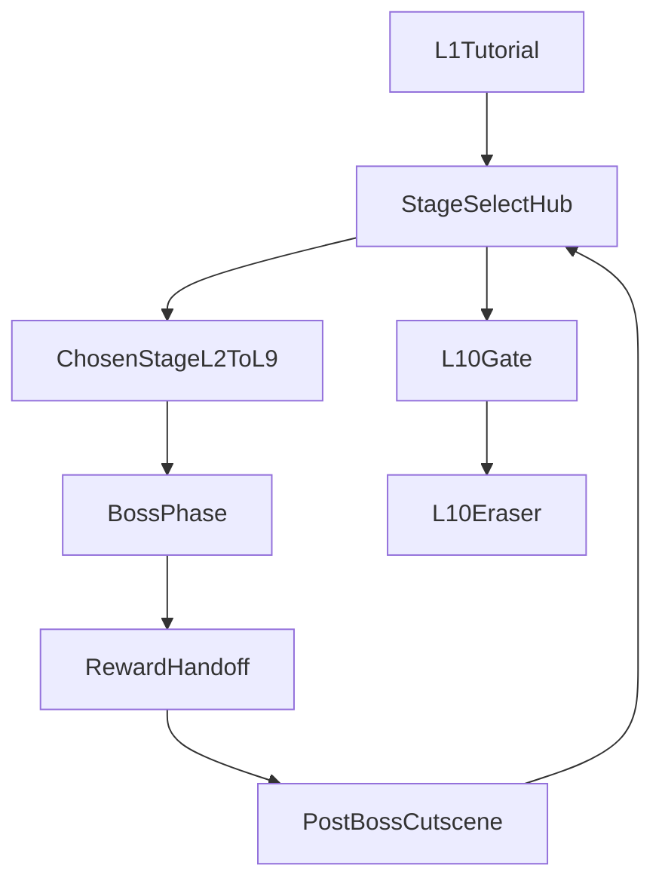

# Stage Select And Progression

## Purpose

This document defines the non-linear Stage Select hub and progression model for the Megaman X-style redesign in `design/master-plan.md`.

It exists to answer five questions before implementation:

- what the player sees and can select after `L1`
- what persistent state each page in the hub needs
- how boss rewards update hub progression
- how `L10` unlocks and is presented
- what current engine fields must be replaced or extended

## Canonical Sources Of Truth

The following remain canonical:

- `design/master-plan.md` for the target Stage Select experience, the rule that `L2-L9` are all open immediately, and the rule that `L10` unlocks only after all 8 bosses are defeated
- `design/systems/ability-framework.md` for persistent ability unlocks and equipped ability state
- `design/systems/boss-framework.md` for boss reward handoff, including healed-page semantics
- the level docs in `design/levels/` for per-level difficulty guidance and replay-value notes

This document defines how that progression should be represented in the hub, in save data, and in the runtime state machine.

## Design Decisions

- Stage Select becomes the campaign hub after the `L1` tutorial.
- `L2-L9` are all selectable immediately on first arrival at the hub.
- Page healing is tied to boss defeat, not just stage entry or partial progress.
- The hub should track per-page state directly rather than inferring progression from a single `highestUnlockedLevel` number.
- `highestUnlockedLevel` should be retained only as a compatibility and migration field during implementation transition.
- `L10` should appear as a separate finale gate, not as just another ordinary page in the `L2-L9` grid.
- Replay remains first-class because hidden interactions, achievements, and bonus star ratings depend on revisiting healed pages with new abilities.
- Endless-mode gating should no longer depend on linear level number progression.

## Hub Timing And Flow

## When Stage Select Appears

- The player completes `L1`.
- Instead of entering the old linear unlock ladder, the player is routed to Stage Select.
- Stage Select becomes the default campaign return point after `L2-L9` boss completion flows.

## Core Campaign Flow



## Return Rules

- Failing a stage or boss still routes through the normal retry/game-over loop.
- Completing a boss reward sequence returns the player to Stage Select.
- Re-entering a previously healed page should drop the player back into its full stage flow, now with the current unlocked ability set available.
- Exiting Stage Select returns to the main menu.

## Hub Layout

## Main Page Grid

The primary hub surface should show exactly 8 page entries for `L2-L9`.

Each page shows:

- level name
- corruption-type icon
- difficulty hint
- healed/corrupted visual state
- earned ability icon when the boss has been defeated
- replay information such as stars or best score

The 8-page grid is the campaign body. It is where the player reads progression at a glance.

## L10 Placement

`L10` should not occupy one of the eight normal page slots.

Recommended presentation:

- a separate central or top-level finale gate
- visually sealed or unfinished until all 8 bosses are defeated
- clearly framed as the culmination of the notebook, not another peer stage

Reasons:

- the master plan describes the Stage Select as 8 corrupted pages for `L2-L9`
- `L10` has different structure than the other stages
- `L10` grants no new ability and functions as campaign payoff rather than another branch node

## Per-Page Presentation States

Each page should support these visual states:

- `AvailableCorrupted`
- `Selected`
- `Healed`
- `ReplayReady`
- `FinaleLocked` for the separate `L10` gate
- `FinaleUnlocked`

`ReplayReady` is a healed page with persistent completion history and remaining replay incentives such as hidden interactions, stars, or achievements.

## Persistent Progression Vocabulary

## Why `highestUnlockedLevel` Is No Longer Enough

The current game uses `highestUnlockedLevel` as both:

- the level-select availability rule
- the endless-mode unlock proxy

That works only for a strictly linear campaign. The redesign needs progression to answer:

- which of the 8 pages have had their bosses defeated
- which abilities are permanently unlocked
- whether `L10` is unlocked
- what replay history exists on each page

That cannot be expressed cleanly as one inclusive maximum level number.

## Recommended Persistent Model

Use per-level progression records for `L2-L10`.

Recommended vocabulary per level:

- `stageSeen`
- `stageCompleted`
- `bossDefeated`
- `pageHealed`
- `bestScore`
- `bestStars`

For the hub, the key flags are:

- `bossDefeated`
- `pageHealed`

In normal `L2-L9` flow, those should usually become true together after the boss reward handoff completes.

## Page State Definitions

### `L2-L9`

- `OpenCorrupted`
- selectable
- boss not yet defeated
- page still visually corrupted

- `Healed`
- selectable
- boss defeated
- page visually calmed
- ability icon shown

- `ReplayReady`
- same as `Healed`, but with additional replay incentive indicators such as hidden interactions discovered, stars, or best score

### `L10`

- `Locked`
- hidden behind a sealed finale gate
- visible as the unfinished final page or eraser seal

- `Unlocked`
- selectable once all 8 prior bosses are defeated

- `Completed`
- final campaign clear state

## Unlock Rules

## Starting State After `L1`

On first arrival at Stage Select:

- `L2-L9` are `OpenCorrupted`
- all 8 page entries are selectable
- `L10` is `Locked`

## Boss Reward Updates

When a boss reward handoff is consumed:

- mark the source page as `bossDefeated = true`
- mark the page as `pageHealed = true`
- unlock the corresponding ability through the ability framework
- refresh the Stage Select page to show the earned ability icon and reduced corruption

## L10 Unlock Rule

`L10` becomes `Unlocked` only when all 8 `L2-L9` pages have `bossDefeated = true`.

Recommended implementation check:

- `healedPageCount == 8`

This is more explicit and future-proof than trying to infer finale eligibility from level-number progression.

## Replay Model

Replay is part of the progression loop, not postgame cleanup.

The Stage Select doc should assume:

- healed pages remain replayable forever
- replay uses the current persistent ability unlock set
- replay can improve stars and high score
- replay can reveal hidden interactions and achievements
- replay does not re-lock a page or remove an earned ability

## Hub Metadata Contract

Each `L2-L9` page should expose:

- `levelId`
- display name
- corruption icon id
- difficulty hint text
- healed state
- earned ability id
- best score
- best stars
- optional replay cue flags

Optional replay cue flags may include:

- `hasUndiscoveredSecrets`
- `hasUnclaimedAchievementHooks`
- `hasIncompleteStars`

Those cues are optional for first implementation, but the data model should leave room for them.

## Equipped Ability In The Hub

The hub should surface current ability state without becoming an inventory screen.

Recommended behavior:

- show the currently equipped ability in a small hub status strip or footer
- allow cycling equipped ability from the hub only if it is cheap to implement later
- always show unlocked ability count or earned icons indirectly via healed pages

The hub should respect the equipped ability persisted by the ability framework, but it should not redefine ability-management rules.

## Difficulty Hints

The master plan requires a difficulty hint on each page.

These hints should be:

- static design text, not dynamically computed
- informed by the level docs' intended order guidance
- visible enough to help players choose a path without forcing a route

Examples of how they should function:

- early-friendly
- spatial puzzle
- precision heavy
- late-game pursuit
- final pre-Eraser

The exact copy belongs in stage content data later, but the Stage Select doc should reserve a field for it.

## Relationship To Score And Stars

The current hub shows stars and best score in the same list row. The redesigned hub should keep those signals but make them secondary to page state.

Recommended priority order on each page:

1. page identity and corruption theme
2. healed or corrupted state
3. earned ability icon
4. difficulty hint
5. stars and best score

This keeps the screen readable as a progression hub first and a stats board second.

## Boss Reward Handoff Consumption

The boss framework already defines reward handoff as the contract boundary after defeat.

Stage Select should consume these fields conceptually:

- `sourceLevelId`
- `abilityRewardId`
- `healedPage`
- optional cutscene or reward token

Stage Select should not decide whether a boss was defeated. It only reflects and persists the result of that event.

## Endless-Mode Gating

## Why Current Gating Breaks

The current menu uses:

- `highestUnlockedLevel >= 6`

as shorthand for:

- player has beaten Level 5

The endless controller also derives available mechanics from `highestUnlockedLevel`.

That logic no longer fits the redesign because progression is no longer expressed as a simple highest level number.

## Recommended Endless Rule

Endless-mode gating should be based on healed-page progress, not linear unlock depth.

Recommended rule:

- unlock Endless Mode after the player heals at least 4 pages

Reasons:

- it preserves the mid-campaign unlock feel
- it is understandable in a non-linear structure
- it does not require beating a specific route order

Recommended mechanic availability rule for endless:

- each healed page contributes its corresponding hazard to the endless mechanic pool

This preserves the spirit of the current endless controller while aligning it with non-linear progression.

## Engine-Facing Data Changes

## `StateManager`

Replace or extend current persistent progression with:

- per-level progression records
- healed-page count
- `l10Unlocked` or a derived check from healed pages

Retain temporarily for migration:

- `highestUnlockedLevel`

Also continue to store:

- `highScores[]`
- `starRatings[]`
- equipped ability state from the ability framework

## `SaveManager`

Add a new save version that persists:

- per-level page progression flags
- healed-page count or equivalent derived data
- finale unlock state if stored explicitly

Migration guidance:

- preserve old `highestUnlockedLevel` reads for backwards compatibility
- convert old linear saves into initial page-state defaults on load

Recommended migration behavior for old saves:

- treat previously cleared linear levels as at least `stageCompleted`
- infer `bossDefeated/pageHealed` conservatively only if the redesign introduces boss rewards after migration and the team agrees on a mapping

If that mapping is too ambiguous, the implementation should migrate only coarse unlock access and leave redesign-specific page-heal state to new-progress runs.

## `LevelConfig`

Add or reserve fields for:

- corruption icon id
- difficulty hint
- stage-select display ordering
- finale-gate metadata for `L10`

The system does not need a full content-data rewrite immediately, but Stage Select needs more than the current linear list name/subtitle pair.

This should be treated as the hub-facing metadata layer in a phased `LevelConfig` expansion:

- Phase 1 adds `abilityReward`
- Phase 2 adds Stage Select presentation metadata
- Phase 3 adds `bossConfig`

Stage Select metadata should not absorb boss runtime data or replace the earlier ability reward field.

## `LevelSelectState`

The current `LevelSelectState` should be conceptually replaced by a Stage Select state that:

- renders 8 page tiles plus the finale gate
- reads per-page progression records rather than `highestUnlockedLevel`
- returns to gameplay with a chosen level id
- visually updates healed pages after reward flow

## Out Of Scope

This document does not define:

- boss runtime mechanics
- post-boss cutscene scripts
- ability activation rules
- `L10` fight mechanics
- achievement implementation details

It only defines how campaign progression is presented and persisted in the Stage Select hub.

## Recommended Interfaces

The final implementation does not need to use these exact names, but it should provide equivalent contracts:

```cpp
struct LevelProgress {
    bool stageSeen = false;
    bool stageCompleted = false;
    bool bossDefeated = false;
    bool pageHealed = false;
    int bestScore = 0;
    int bestStars = 0;
};

class CampaignProgress {
public:
    bool IsPageOpen(int levelId) const;
    bool IsPageHealed(int levelId) const;
    bool IsL10Unlocked() const;
    int GetHealedPageCount() const;
};
```

## Implementation Notes Against Current Code

- `src/LevelSelectState.cpp` currently renders a two-column linear list of all 10 levels and gates selection with `(i + 1) <= highestUnlockedLevel`; the redesigned hub should replace that rule with per-page progression checks.
- `src/StateManager.h` currently stores `highestUnlockedLevel`, `highScores[]`, and `starRatings[]`; the redesign needs persistent per-page state, not just a maximum unlocked number.
- `src/SaveManager.cpp` currently saves linear progression in version `3`; the redesigned hub will require a new version and migration path.
- `src/MenuState.cpp` currently unlocks endless with `highestUnlockedLevel >= 6`; this must be redefined against healed-page progression.
- `src/EndlessModeController.cpp` currently builds mechanic availability from linear completion assumptions; later implementation should derive its mechanic pool from healed pages instead.

## Exit Criteria

The Stage Select system is fully designed when implementation can proceed without open questions about:

- what appears in the hub after `L1`
- how page healing and ability rewards change page state
- how `L10` unlocks and is displayed
- how replay is represented
- what progression data must be saved
- which current linear-progression fields are replaced versus temporarily retained for migration
